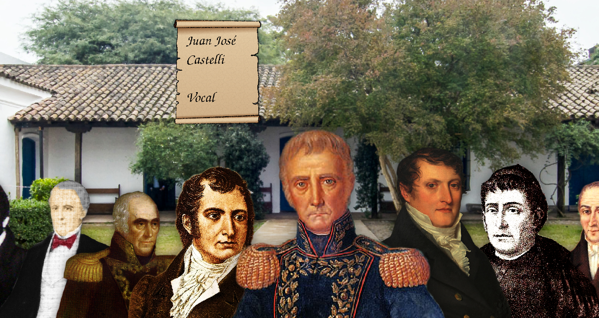
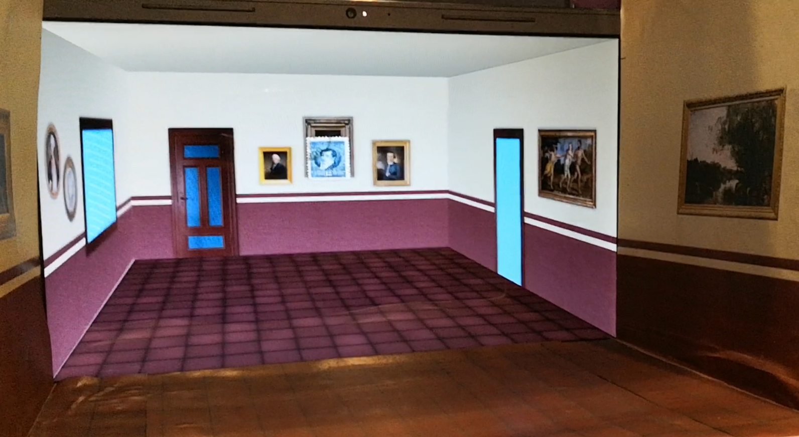

# parallax-portal





## Description on English

Augmented reality demo. Determines the position of your head using your webcam
and shows images giving the illusion of a 3D space behind your screen.

Code written in English with comments and documentation on Spanish.

Based on
[ScreenReality from A. Girault](https://github.com/agirault/screenReality).

Features:

- Kalman filter for predictions and filtering
- Can reach screen refresh rate (60fps) using detections at camera refresh rate
  (30fps), using two threads and Kalman filter predictions.
- 2D visualization using Pygame
- 3D visualization using modern OpenGL
- On-screen configuration menu (press Spacebar) for easy tuning of parameters

Installation:

```
cd parallax-portal
pipenv install
pipenv shell
./main.py parallax

# For testing parts of the program:
./main.py face_detection
./main.py scene_2d
./main.py scene_3d
```

## Descripción

Demostración de realidad aumentada. Determina la ubicación de tu cabeza usando
tu webcam y muestra imágenes dando la ilusión de que hay un espacio
tridimensional dentro de la pantalla.

Código escrito en Inglés con comentarios y documentación en Español.

Basado en
[ScreenReality de A. Girault](https://github.com/agirault/screenReality).

Características:

- Filtro de Kalman para predicciones y filtrado
- Puede alcanzar las tasas de refresco de un monitor (60fps) usando detecciones
  a la tasa de refresco de la webcam (30fps), gracias al uso de dos threads y
  predicciones con filtro de Kalman
- Visualización en 2D usando Pygame
- Visualización en 3D usando OpenGL moderno
- Menú de configuración en pantalla (presionar Espacio) para configurar los
  parámetros fácilmente

## Dependencias Python

Usar Pipenv para instalar todas las dependencias en un virtualenv:

```
pipenv install
```

Puede que tarde muchísimo en `Locking...`, pero después de un tiempo largo
termina.

Si no anda puede que algunas dependencias como pyopengl requieran paquetes de
GNU/Linux, en tal caso mirar la lista de dependencias en el archivo `Pipfile` y
buscar los requerimientos de cada dependencia.

Si no se quiere usar Pipenv, instalar cada paquete que figura en el archivo
`Pipfile` con `pip3`.

## Ejecucion de Python

Si se usa Pipenv primero hacer:

```
pipenv shell
```

Despues para iniciar el programa:

```
./main.py parallax
```

Para probar las distintas demos se puede hacer:

```
./main.py scene_3d
./main.py face_detection
...
```

Presionar tecla espacio para ver el menú de debug.

## Estructura Python

Hay varios archivos, la idea es que `main.py` dependiendo de los argumentos
inicie el programa completo en el `main()` de `parallax.py` o ejecute funciones
`demo()` en distintos modulos. De esa forma cada modulo tiene una "demo" o una
prueba cortita para probar si anda lo que esta ahí adentro. Cada intrgrante pudo
trabajar en una demo sin que hayan conflictos y los últimos díás de trabajo
hicimos `parallax.py` que integró todo.

- `main.py`: Es el punto de inicio, el programa se ejecuta desde aca.

- `parallax.py`: Importa todos los modulos y usa las funciones de todos los
  demas archivos, tiene una funcion `main()` que corre el programa en serio.

- `video.py`: Maneja la ventana, pygame y las cosas basicas de OpenGL.

- `scene_3d.py`: Tiene las funciones de dibujado para OpenGL y en su `demo()`
  muestra la escena 2D manejada por el mouse.

- `scene_2d.py`: Tiene las funciones de dibujado 2D en pygame y en su `demo()`
  muestra la escena 3D manejada por el mouse.

- `face_detection.py`: Tiene las funciones de deteccion de cara en OpenCV y en
  su `demo()` muestra la cámara y la cara detectada

- `misc.py`: Contiene el filtro de Kalman

## Referencias

- [ScreenReality de A. Girault](https://github.com/agirault/screenReality).

- http://csc.lsu.edu/~kooima/pdfs/gen-perspective.pdf

- https://www.youtube.com/watch?v=SWt_y5uIEAo

- Tutoriales OpenGL:

  - http://pyopengl.sourceforge.net/context/tutorials/index.html

  - https://learnopengl.com/

  - https://www.opengl-tutorial.org/beginners-tutorials/tutorial-2-the-first-triangle/

  - https://stackoverflow.com/questions/24416589/glsl-using-custom-output-attribute-instead-of-gl-position

  - https://gist.github.com/binarycrusader/5823716a1da5f0273504

  - https://github.com/JoeyDeVries/LearnOpenGL/blob/master/src/6.pbr/1.2.lighting_textured/lighting_textured.cpp

Inspirado en:

- https://gitlab.kitware.com/mike.rye/paraview_face_tracking

- https://github.com/DhananjaiH/Head-tracking

- http://johnnylee.net/projects/wii/

- https://youtu.be/Jd3-eiid-Uw?t=214

- https://www.youtube.com/watch?v=bBQQEcfkHoE

- https://www.youtube.com/watch?v=h5QSclrIdlE&

Herramientas varias:

- https://christopherchudzicki.github.io/MathBox-Demos/parametric_curves_3D.html

- https://www.cs.utexas.edu/~teammco/misc/kalman_filter/

## Atribuciones y orígenes de las imágenes

- Estampillas: Dominio público: https://commons.wikimedia.org/wiki/Stamps_of_Argentina

- `casa_tucuman.jpg`: Modificación de
  https://www.flickr.com/photos/culturaargentina/27472263894/in/photostream/
  Secretaría de Cultura de la Nación Attribution-ShareAlike 2.0 Generic
  (CC BY-SA 2.0)

- `belgrano.png`: Dominio público: https://commons.wikimedia.org/wiki/File:Retrato_del_Gral._Manuel_Belgrano_-_Atribu%C3%ADdo_a_Francois_Casimir_Carbonnier.jpg

- `saavedra.png`: Dominio público: https://commons.wikimedia.org/wiki/File:Cornelio_Saavedra_-_1810.jpg

- `moreno.png`: Dominio público: https://commons.wikimedia.org/wiki/File:Mariano_Moreno.jpg

- `paso.png`: Dominio público: https://commons.wikimedia.org/wiki/File:Juanjpaso.jpg

- `alberti.png`: Dominio público: https://commons.wikimedia.org/wiki/File:Manuel_Alberti_2.jpg

- `azcuenaga.png`: Dominio público: https://commons.wikimedia.org/wiki/File:Miguel-Azcu%C3%A9naga_new.png

- `castelli.png`: Dominio público: https://commons.wikimedia.org/wiki/File:Castelli.jpg

- `matheu.png`: Dominio público: https://commons.wikimedia.org/wiki/File:Retrato_de_Domingo_Matheu.jpg

- `larrea.png`: Dominio público: https://commons.wikimedia.org/wiki/File:Juan_Larrea.jpg

- Fondo de carteles (scrolls): Pizabay license: https://pixabay.com/vectors/scrolls-rolls-papyrus-papers-34607/

- Skybox (sin usar): Ivar Leidus [CC BY-SA 3.0 ee (https://creativecommons.org/licenses/by-sa/3.0/ee/deed.en)] https://commons.wikimedia.org/wiki/File:Suurupi_alumine_tuletorn_panoraam.jpg

- Varias Texturas con licencia CC0 de https://opengameart.org/

- Texturas de Darkwood67 https://www.deviantart.com/darkwood67/gallery/11280947

- Puerta en scene_3d: https://commons.wikimedia.org/wiki/File:Holmstadengen_en_rimfrostdag_i_november_04.jpg

- Cuadros: Sailko [CC BY-SA 4.0
  (https://creativecommons.org/licenses/by-sa/4.0)], los demás son de dominio
  público.

## Notas

- Ayuda mucho poner una caja para continuar el efecto fuera de la pantalla, ver
  el informe

- A mí me ayuda cerrar un ojo para dar una mejor sensación de profunidad

- Es importantísimo que haya suficiente luz iluminando la cara de la persona.
  Tanto para la detección como para la tasa de refresco. Por ejemplo mi webcam
  funciona a 30fps pero noté que en ambientes levemente oscuros devuelve
  imágenes (borrosas) a 15fps

## Arreglar del proyecto de C++

- El parametro `pixel_per_cm` es el pixeles por centimetro del monitor y hay
  que ajustarlo

- Habia un error en el programa original en donde `cx` y `cy` eran el doble de
  lo que deberían

- Hay que ayustar la posicion de la camara respecto a la pantalla, el programa
  original no lo hacía

- Ayuda que los cuadrados de las paredes sean cuadrados y no rectángulos

- Ayuda mucho poner una caja para continuar el efecto fuera de la pantalla

- Ayuda mucho cerrar un ojo

- Es importantísimo que haya suficiente luz iluminando la cara de la persona.
  Tanto para la detección como para la tasa de refresco. Por ejemplo mi webcam
  funciona a 30fps pero noté que en ambientes no tan oscuros devuelve imágenes
  a 15fps

## Mejoras por hacer

- Hacer que la posicion de la camara cuando pierda detección lentamente se vaya
  centrando

- Ver si estamos usando el mejor XML para haarcascade

- Poner un mensaje que diga algo de "No hay caras detectadas, acercarse para ver
  el efecto, una persona a la vez"

- Hacer mas linda la escena 3d

- Dejar de usar Pygame, no tiene aceleración por hardware

- Adaptar para su uso en monitores 3D, mejoraría mucho la experiencia
